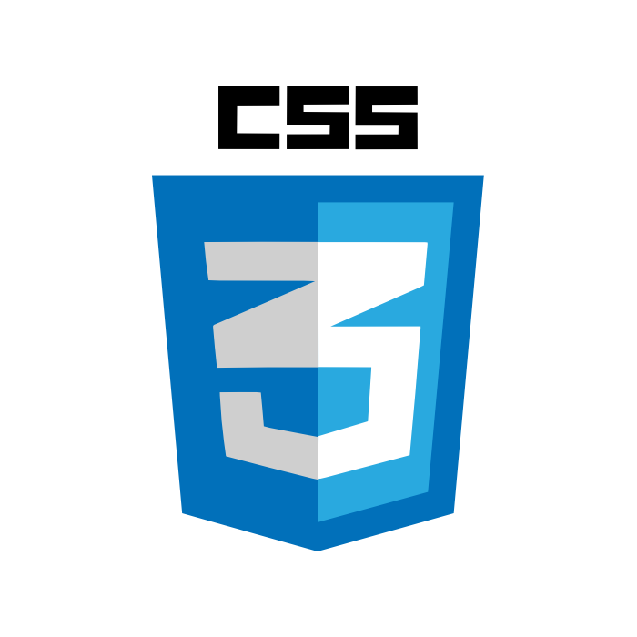

# ggezkr

## About this project

### Summary
This service is analyzing Overwatch Gamers Statics daily and grade. Diplaying statics services were already existed. But I thought that type of services just displayed meaningless number. For example, User only can see number which is accumulated score.

 I think User wants to know what was today play, yesterday play and week play. And using comparing other user's statics, they want to get feed back  about how themselves palyed.(In that time I used to play Overwatch). So, I decided to develop this project.

### Stack

<<<<<<< HEAD

=======
 
 
 
 
 
 

>>>>>>> a5d400d9df08a5758839fe23e497b693326062fc

### Opinion
When I started this project, I totally have no idea about Web Application(I was a Mechanical Designer) I just focused on the finished this project.

As a result, this web application got a little issued in Overwatch Gamer but now it is on the steadily decreasing.

The most reason is this project has never used updated. I had try to update this software several times. but I failed. Because this code is not separated properly, Not only Model, View and Controller but also Function. So I reallize Software which can be maintenanced easily is very important. 

### Future
I'm still newbie in programming. but I will change this application structure using MEAN stack(MongoDB, Express, Angularjs, Nodejs)

### About date
* Develop Period
    * Dec 5, 2016 ~ Feb 7, 2017
* Service Start
    * Feb 7, 2017
* Update
    * No update

### Result

#### Web
This web application totally considered Responsive Desigin in Mobile and Web.

[link to ggez.kr](http://ggez.kr)

#### Visitor

## Reference
- [Html and Css Style Guide](https://google.github.io/styleguide/htmlcssguide.html)
- [CSS(How to)](https://www.w3schools.com/howto/)
- [GitHub Project] https://git-scm.com/book/ko/v2/GitHub-GitHub-프로젝트에-기여하기

